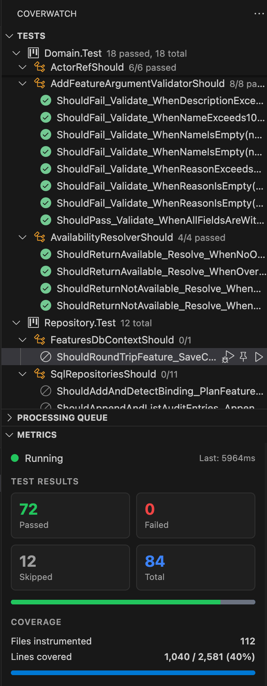

# Coverwatch — .NET Continuous Testing

**Your tests run while you type. Every line of code turns green or red. You never press "Run Tests" again.**

Coverwatch brings the continuous testing workflow to VS Code for C#/.NET. It watches your code, figures out which tests are affected by your changes using **impact analysis**, re-runs only those, and paints every line in your editor with live pass/fail coverage — all before you've switched to the terminal.

---

## See It In Action



Every line gets a marker. Green means covered and passing. Red means a test is failing on that line. Gray means nothing tests it. Hover any marker to see exactly which tests touch that line.

---

## Why Coverwatch

### You change code. Only the right tests re-run.

Most test runners give you two options: run everything (slow) or pick tests manually (tedious). Coverwatch does neither.

On the first run, it maps every line of your source code to the tests that execute it. After that, when you save a file, it diffs your changes, looks up which tests cover those lines, and runs only those. Three tests instead of three hundred.

The coverage map rebuilds itself with every run, so it stays accurate as your codebase evolves.

### No buttons. No config files. No ceremony.

Open a workspace with .NET test projects. Coverwatch detects them, runs the suite, builds the coverage map, and starts watching. You just write code.

### Everything you need, right in the editor.

**Gutter markers** on every line — green, red, or gray.

**CodeLens** above every test method — status, duration, one-click run, one-click debug, and the first line of any failure message.

**Sidebar** with a full test tree (Project → Class → Method), a processing queue showing what's running, and a metrics dashboard with pass/fail counts and coverage stats.

**Status bar** showing engine state and a live summary — `Coverwatch: 42 ✓ 2 ✗`.

---

## How It Works

```
  You save a file
       │
       ▼
  File Watcher detects the change, diffs old vs new content
       │
       ▼
  Impact Analyzer looks up changed lines in the Coverage Map
       │
       ▼
  Only affected tests are passed to the Test Runner
       │
       ▼
  dotnet test --filter runs the subset with Coverlet coverage
       │
       ▼
  Results parsed (TRX + Cobertura XML)
       │
       ▼
  Coverage Map updated ──► Gutter markers refresh
                        ──► CodeLens updates
                        ──► Sidebar tree updates
                        ──► Status bar updates
```

**Cold start** — first run executes all tests with full coverage collection. Takes a bit.

**Warm** — subsequent saves only trigger affected tests. Usually finishes before you've read the next line of code.

---

## Supported Test Frameworks

Works with **xUnit**, **NUnit**, and **MSTest**. Auto-detected from your `.csproj` references.

---

## Getting Started

**1.** Make sure your test projects include the Coverlet collector (most templates already do):

```bash
dotnet add package coverlet.collector
```

**2.** Install Coverwatch from the VS Code Marketplace.

**3.** Open a workspace containing .NET test projects.

**4.** That's it. The engine starts automatically, runs your suite, and from then on you just code.

If you prefer to start manually: `Ctrl+Shift+P` → **Coverwatch: Start Engine**.

---

## Configuration

All settings live under `coverwatch.*` in your VS Code settings.

| Setting | Default | What it does |
|---|---|---|
| `autoStart` | `true` | Start the engine when a test project is detected |
| `runOnSave` | `true` | Trigger affected tests on file save |
| `runOnChange` | `false` | Trigger on every keystroke (with debounce) — more responsive, heavier on CPU |
| `debounceMs` | `500` | Debounce delay when `runOnChange` is enabled |
| `maxParallelRuns` | `2` | Concurrent `dotnet test` processes |
| `coverageThreshold` | `80` | Target coverage percentage for the metrics panel |
| `excludePatterns` | `[**/obj/**, **/bin/**, **/Migrations/**]` | Glob patterns to ignore |
| `dotnetPath` | `"dotnet"` | Custom path to the .NET CLI |
| `showGutterMarkers` | `true` | Toggle the coverage dots |
| `showCodeLens` | `true` | Toggle the inline test actions |
| `verboseOutput` | `false` | Detailed logging in the output channel |

---

## Commands

| Command | What it does |
|---|---|
| **Start Engine** | Begin watching and running tests |
| **Stop Engine** | Pause everything |
| **Run All Tests** | Force a full re-run of the entire suite |
| **Reset Coverage Map** | Clear the map and rebuild from scratch |
| **Toggle Gutter Markers** | Show or hide the dots |
| **Show Dashboard** | Open the output channel for logs |

---

## Requirements

- .NET SDK 6.0 or later
- `coverlet.collector` NuGet package in your test projects
- The C# extension (for debug support)

---

## Good to Know

The **first run takes longer** because it builds everything and collects full coverage. Every run after that is targeted and fast.

If something seems off, open the **Coverwatch** output channel — it logs every decision the engine makes: which files changed, which tests were selected, and how long each run took.

For very large solutions (1000+ tests), try bumping `maxParallelRuns` to 4.

---

## License

MIT